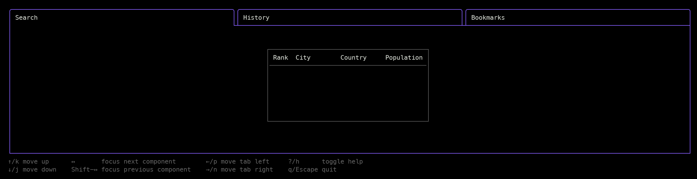

# Bash Tools Command Bookmarker

[](https://github.com/SchwarzIT/go-template)

> **_TIP:_** Checkout related projects of this suite
>
> - [My documents](https://fchastanet.github.io/my-documents/)
> - [Bash Tools Framework](https://fchastanet.github.io/bash-tools-framework/)
> - [Bash Tools](https://fchastanet.github.io/bash-tools/)
> - [Bash Dev Env](https://fchastanet.github.io/bash-dev-env/)
> - [Bash Compiler](https://fchastanet.github.io/bash-compiler/)
> - [Bash Tools Command Bookmarker](https://fchastanet.github.io/bash-tools-command-bookmarker/)

<!-- markdownlint-capture -->

<!-- markdownlint-disable MD013 -->

[](https://github.com/fchastanet/bash-tools-command-bookmarker/releases)
[](https://github.com/fchastanet/bash-tools-command-bookmarker/blob/master/LICENSE)
[](https://github.com/pre-commit/pre-commit)
[](https://github.com/fchastanet/bash-tools-command-bookmarker/actions?query=workflow%3A%22Lint+and+test%22+branch%3Amaster)
[](http://opensource.box.com/badges "Project Status")
[](https://deepsource.io/gh/fchastanet/bash-tools-command-bookmarker/?ref=repository-badge)
[](https://deepsource.io/gh/fchastanet/bash-tools-command-bookmarker/?ref=repository-badge)
[](http://isitmaintained.com/project/fchastanet/bash-tools-command-bookmarker "Average time to resolve an issue")
[](http://isitmaintained.com/project/fchastanet/bash-tools-command-bookmarker "Percentage of issues still open")

<!-- markdownlint-restore -->

- [1. Excerpt](#1-excerpt)
- [2. Documentation](#2-documentation)
  - [2.1. Go Libraries used](#21-go-libraries-used)
- [3. Development](#3-development)
  - [Necessary tools](#necessary-tools)
  - [3.1. Pre-commit hook](#31-pre-commit-hook)
  - [3.2. Build/run/clean](#32-buildrunclean)
    - [3.2.1. Build](#321-build)
    - [3.2.2. Tests](#322-tests)
    - [3.2.3. Coverage](#323-coverage)
    - [3.2.4. run the binary](#324-run-the-binary)
    - [3.2.5. Clean](#325-clean)
- [4. Commands](#4-commands)

## 1. Excerpt

> [!WARNING]
>
> **Development in progress, not functional yet !**



This tool provides a terminal-based user interface (TUI) for managing and
organizing shell commands. It allows users to:

- Save frequently used shell commands as bookmarks
- Categorize commands with tags
- Search through saved commands quickly
- Execute bookmarked commands directly from the interface

The application uses the Bubbletea framework to create an interactive terminal
UI with features like:

- Tab-based navigation
- Keyboard shortcuts
- Focus management between different UI components
- Command organization and filtering

This tool is part of a larger suite of Bash productivity tools designed to
enhance shell workflows and command management.

## 2. Documentation

### 2.1. Go Libraries used

- [slog](https://pkg.go.dev/golang.org/x/exp/slog) is logging system
  - [slog tutorial](https://betterstack.com/community/guides/logging/logging-in-go/#customizing-the-default-logger)
- [Bubbletea](https://github.com/charmbracelet/bubbletea) A powerful little TUI
  framework.
- Not a library, but a lot of snippets, ui logic and design have been taken from
  [PUG - A terminal user interface for terraform power users](https://github.com/leg100/pug).
- snippets from
  [Brandon Fulljames](https://github.com/Evertras/bubble-table/blob/main/table/dimensions.go)

## 3. Development

### Necessary tools

```bash
go install golang.org/x/tools/cmd/goimports@latest
```

### 3.1. Pre-commit hook

This repository uses pre-commit software to ensure every commits respects a set
of rules specified by the `.pre-commit-config.yaml` file. It supposes pre-commit
software is [installed](https://pre-commit.com/#install) in your environment.

You also have to execute the following command to enable it:

```bash
pre-commit install --hook-type pre-commit --hook-type pre-push
```

Now each time you commit or push, some linters/compilation tools are launched
automatically

### 3.2. Build/run/clean

Formatting is managed exclusively by pre-commit hooks.

#### 3.2.1. Build

```bash
.build/build-docker.sh
```

```bash
.build/build-local.sh
```

#### 3.2.2. Tests

```bash
.build/test.sh
```

#### 3.2.3. Coverage

```bash
.build/coverage.sh
```

#### 3.2.4. run the binary

```bash
.build/run.sh
```

#### 3.2.5. Clean

```bash
.build/clean.sh
```

## 4. Commands

Run the project

```bash
go run ./main
```
